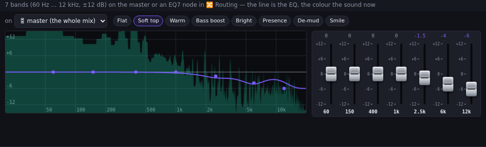
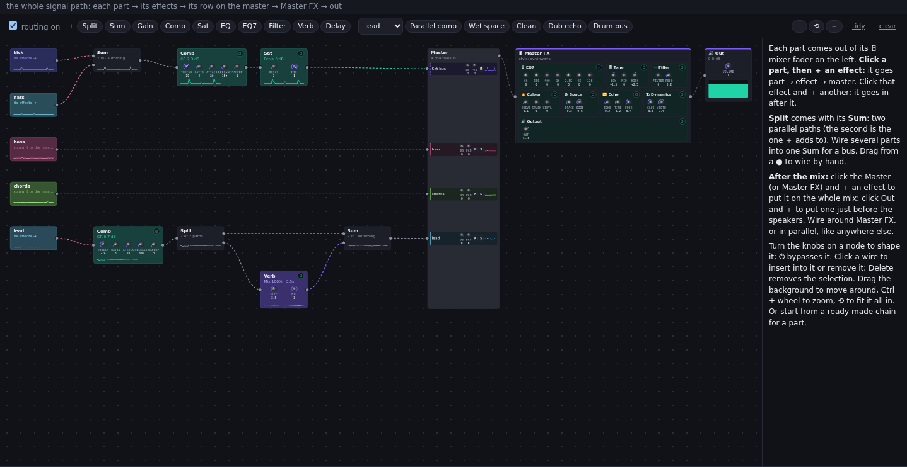
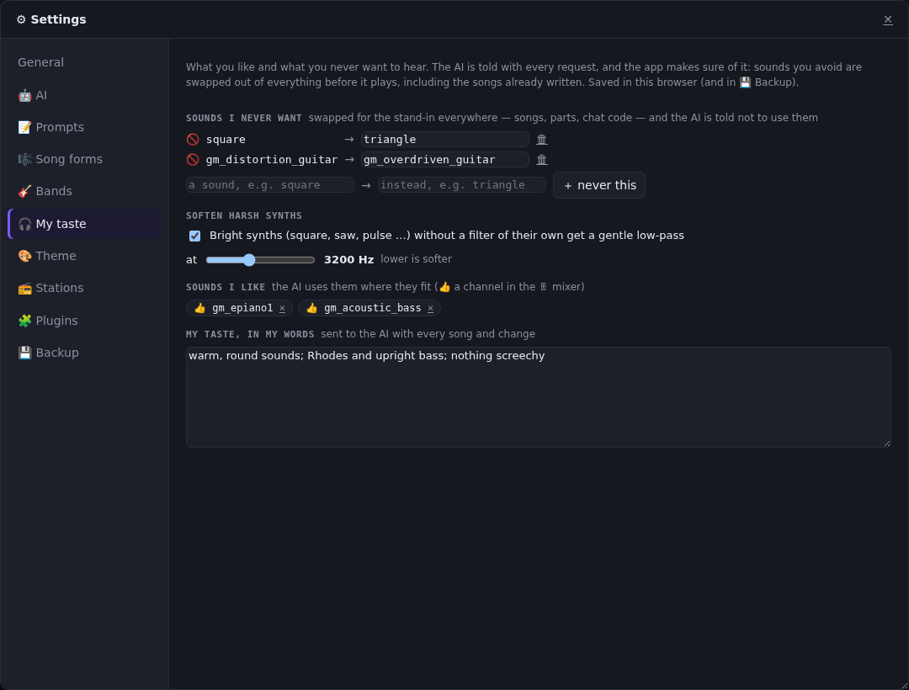

# Strudel AI — feature tour

Screenshots of every part of the app, taken with `npm run screenshots` (the app in a real browser, with a demo AI that writes the song "Neon Rain"). See the [README](../README.md) for how each feature works.

## Three modes

### 📻 Radio: stations write songs for you
Pick or describe a station, put it on air, and an AI agent keeps inventing, writing and playing songs for its theme. The code of the section that's playing is in the editor, and the panels on the right show the station, the playlist and the song that's playing.

| 📻 Station | 📃 Playlist | 🎶 Now playing |
|---|---|---|
|  |  |  |
| The theme, form and band for its songs, and what's on air. | What's playing and coming up: play next, reorder, remove, loop. | The song's sheet, its sections with live progress, ⏭ go, ⏸ hold, ↺ restart, and its toolbar (✎ edit, ★ favorite, 📁 save, MP3, 🎸 band, 📻 station, link). |

**🎵 Songs:** this session's songs, ★ Favorites (shared on the server) and 📁 My songs (saved, with import / export).

### 🎼 Studio: work on one song with the AI
The chat changes the song open in ✎ Edit song; a new song described in the chat is written, plays and opens there.

**✎ Edit song:** its own ▶ ⏸ ■ ↺ for the song at the top (with where it is: section and bar); the song's title, tempo, meter, scale, master style, ending and feel; melody and hook; sections on a timeline (bars, chords, key, tempo, volume, solo, ⏭ go, 🔁 loop); the arrangement; chord progressions; and the parts.

**Arrangement:** which parts play in each section (variants, coming in / dropping out). The playhead line follows the song.

**☁ Netlify and 👤 accounts:** deploy the app to Netlify as it is (a static site, a function, and the chat as an edge function), or run it in Docker. With Google sign-in on, each person saves their own Anthropic API key, kept encrypted with their account.

**⬇ Export** (🧩 plugins): a song's ⬇ Export menu offers its JSON, one **Strudel REPL** program (download, 📋 copy, or ↗ open in strudel.cc), a **MIDI file** (a track per part) and a **lead sheet** (Markdown). Plugins add their own formats (`api.addExporter`).

**🎼 MusicXML import** (🧩 plugin): ⬆ import reads MusicXML scores (`.musicxml`, `.mxl`) as songs: a part per staff, voices together, drums, chord symbols, repeats played out, sections at rehearsal marks. Plugins can add their own importers (`api.addImporter`).

**🎲 Song titles:** every song the AI names gets its own short request with a title shape picked at random (a place, a name, a time, a phrase …), examples in its genre's or band's style, and a check against the titles already used. 🎲 Rename names a song again, or ✏ Name to type your own.

**🧩 Part editor:** one part on its own — ▶ loop it (solo or with its section), shape its effects with sliders, and change its notes.

Melodies on a staff (click to place or move a note, Shift-click for a chord, arrows / octave / length / rest on the selected one). A part with voices shows each in its own colour, ＋ voice adds a harmony, and ＋ layer doubles it on another sound:

Drums on a grid (one row per sound), with velocity as level bars:

Chord-tone arpeggios on a grid, and the part's effects:

### ⌨ Jam: live-code with the AI
You and the AI write one piece of code in the editor; 🎼 Make it a song grows the jam into a whole song in Studio.

## Play along

| 🔲 Pads | 🎹 Keys |
|---|---|
|  |  |
| Trigger one-shots, loops and effects; the AI can program them. | Play any sound from the keyboard or mouse, record into the code. |

## Mix and master

**🎚 Mixer:** the master's inputs as a console, a strip per part (and per bus). Each has pan, M / S, **FX ↗** (its effects on the 🔀 Routing board), 👍 / 👎 for its sound, and a dB fader beside its meter and clip LED. The status bar warns ● HOT / ● CLIP when the mix gets close to the top.

**🎛 Master:** the master at a glance. Its sections in signal order (EQ → Tone → Filter → Colour → Space → Echo → Dynamics → Output) switch on and off, with the style, follow song, save to song, bypass, and what comes out. Their knobs are on the 🔀 Routing board.

**🎚 Equalizer:** 7 bands on the master or an EQ7 node on the 🔀 Routing board. The curve is drawn over the live spectrum, with presets such as Soft top for harsh synths.

**🔀 Routing:** the whole signal path on one board. The parts (left) go through their effects (Split / Sum, Comp, Sat, EQ, EQ7, Filter, Verb, Delay) into the **Master** block, a row per channel with its fader, pan and mute / solo, level with its part. Then **Master FX** (all the master's sections, with knobs and ⏻) and **Out**. Here the drums share a bus, and the lead has a 100 % wet reverb path summed under it.

## Visuals

| 📊 Visualizer | 🌀 Hydra |
|---|---|
|  |  |
| Piano roll, oscilloscope, spectrum, vectorscope and meters. | Hydra visuals that move with the music, in a panel or behind the code. |

## Panels anywhere
Every panel docks, tabs, splits, floats, pops out into its own window or pins on top.

## ⚙ Settings
| General | 🤖 AI | 🎸 Bands |
|---|---|---|
|  |  |  |
| 🎼 Song forms | 📻 Stations | 🎨 Theme |
|  |  |  |

**🎧 My taste:** sounds you never want, each with a softer stand-in. They're swapped out of everything before it plays, including songs already written, and the AI is told. Also: "soften harsh synths" (a low-pass on square / saw / pulse parts), the sounds you liked, and your taste in your own words. 👍 / 👎 on a 🎚 mixer channel adds to it while you listen.

**🧩 Plugins:** panels, buttons, settings pages, themes, bands, forms, stations, sounds, AI instructions and template overrides.

## 🎨 Themes
| Light | Synthwave |
|---|---|
|  |  |
